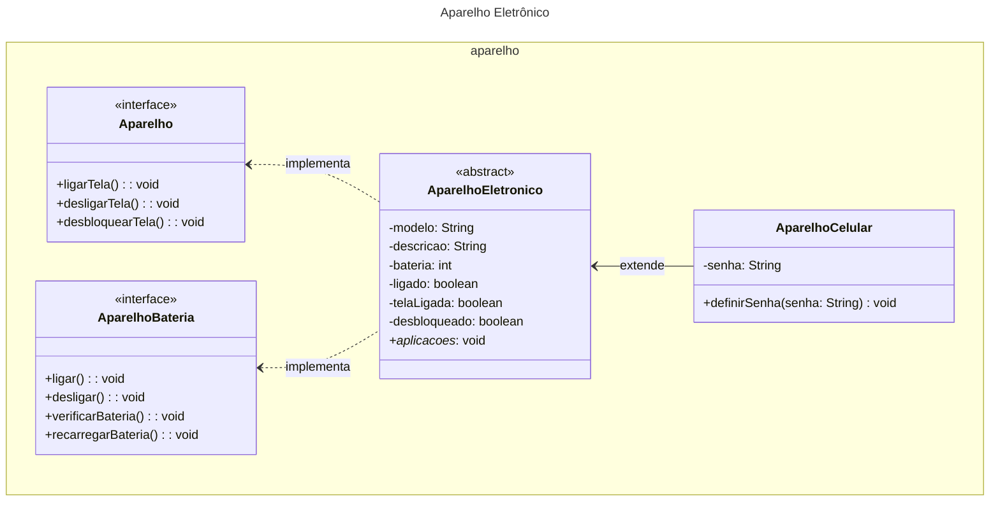

# Classificação da abstração de um Aparelho

```mermaid
---
title: Aparelho Eletrônico
---
classDiagram
  namespace aparelho {
    class Aparelho{
      <<interface>>
      +ligarTela(): void
      +desligarTela(): void
      +desbloquearTela(): void
    }
    class AparelhoBateria{
      <<interface>>
      +ligar(): void
      +desligar(): void
      +verificarBateria(): void
      +recarregarBateria(): void
    }
    class AparelhoEletronico{
      <<abstract>>
      -modelo: String
      -descricao: String
      -bateria: int
      -ligado: boolean
      -telaLigada: boolean
      -desbloqueado: boolean
      *+aplicacoes*: void
    }
    class AparelhoCelular {
      -senha: String
      +definirSenha(senha: String) void
    }
}
Aparelho <.. AparelhoEletronico : implementa
AparelhoBateria <.. AparelhoEletronico : implementa
AparelhoEletronico <-- AparelhoCelular : extende
```

