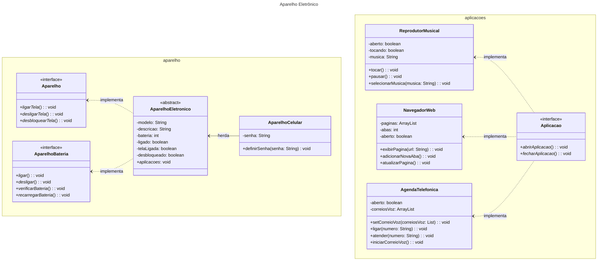

# Classificação da abstração de um Aparelho

## Definindo a estrutura das classes e interfaces usadas na implementação

O projeto é definido basicamente de dois pacotes, definidos através de um namespace. O pacote *aparelho* detém as classes e interfaces responsáveis por simular o funcionamento de um aparelho.  
O segundo pacote (*aplicacoes*) é responsável pelas funcionalidades dos aplicativos de Reprodução de músicas, da Agenda Telefônica e do Navegador Web.

O projeto invoca um objeto aparelho que da opções ao usuário sobre quais aplicações usar e quais serão as suas interações com os aplicativos.

No pacote *aparelho* definimos os comportamentos de um aparelho eletrônico no geral através de duas interfaces. Uma delas define o coportamento interno do aparelho, como ligar e desligar a tela, e na outra definimos o comportamento do aparelho enquanto máquina, como verificar a bateria, carregar a bateria, ligar e desligar aparelho. Essas duas interfaces implementam uma classe abstrata que define o funcionamento de um aparelho eletrônico. Esse aparelho eletrônico é definido pela classe concreta AparelhoCelular que herda os atributos e métodos implementados na classe *AparelhoEletronico* e os que precisam ser implementados, presentes na classe e nas interfaces *Aparelho* e *AparelhoBateria*.  
  
Esse aparelho vai definir, através de escolhas dos usuários, qual aplicação será chamada e executada.  
  
Temos o reprodutor de músicas, onde o usuário seleciona uma música para reproduzir e coloca para tocar. Logo depois, pede para executar uma outra música e repete o ciclo até que o usuário deseje sair.  
Temos também a agenda telefônica, onde o usuário escolhe se quer ligar para alguém, atender uma ligação (caso ela exista), ou ver seus correios de voz.  
E por último, o navegador web, onde o usuário escolhe em qual site deseja navegar, ou se cria uma nova aba ou atualiza a página.  
